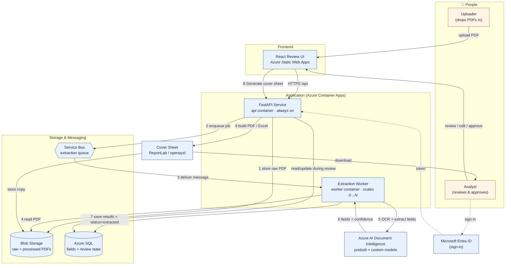
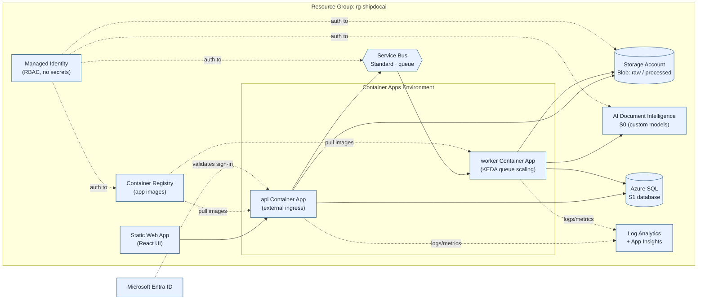
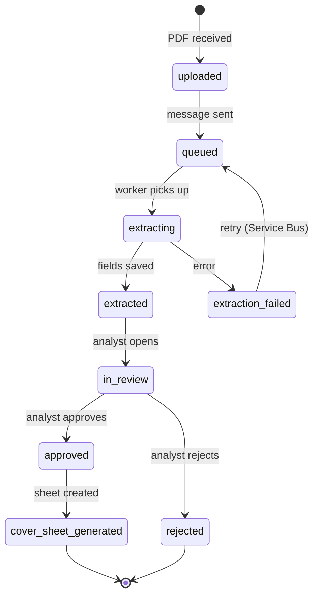
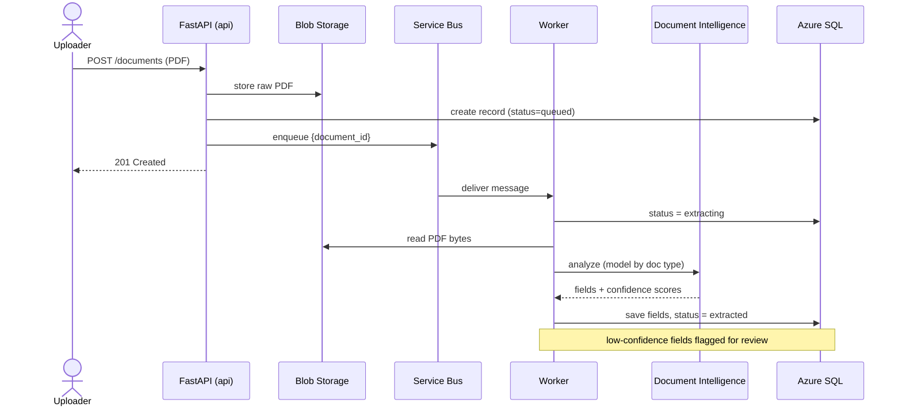

# Shipment Document AI — Architecture & Process Flow

Visual reference for the whole system. The diagrams are written in **Mermaid**,
which GitHub renders automatically. To export them as images, see
`C:\Lion\Projects\Supporting Apps\diagram-tools\`.

- [1. End-to-end process flow (with Azure resources)](#1-end-to-end-process-flow)
- [2. Azure resource architecture](#2-azure-resource-architecture)
- [3. Document lifecycle (status states)](#3-document-lifecycle)
- [4. Extraction sequence (who calls what)](#4-extraction-sequence)
- [5. Azure resource reference table](#5-azure-resource-reference-table)

---

## 1. End-to-end process flow

How a document travels from upload to a finished cover sheet, and which Azure
resource handles each step.

**The numbered path:** upload → (1) store → (2) queue → (3-7) worker extracts via
Document Intelligence and saves → analyst reviews → (8-9) generate & download the
cover sheet. The worker is decoupled by the queue, so bursts of documents don't
slow the upload or the UI.

---

## 2. Azure resource architecture

The same system viewed as deployed Azure resources and how they connect.

**Security model:** the apps authenticate to Storage, Service Bus, Document
Intelligence, and the registry via a **Managed Identity** (no passwords/keys in
config). Defined in `infra/`.

---

## 3. Document lifecycle

The status each document moves through (the `status` field in `shared/enums.py`).

---

## 4. Extraction sequence

Who calls what during the automatic extraction step.

---

## 5. Azure resource reference table

| Resource | Azure service | Role in the flow | Starting tier |
|---|---|---|---|
| **API** | Container Apps | Accepts uploads, serves the review API, generates cover sheets | min 1 replica |
| **Worker** | Container Apps | Consumes the queue, runs extraction, persists results | scales 0→5 (KEDA) |
| **Blob Storage** | Storage Account | Stores raw PDFs + generated cover sheets | Standard_LRS |
| **Service Bus** | Service Bus (Standard) | Decouples upload from extraction; retries failures | Standard |
| **Document Intelligence** | Azure AI Document Intelligence | OCR + field extraction (prebuilt invoice + custom models) | S0 |
| **Azure SQL** | SQL Database | Extracted fields, review state, audit log | S1 |
| **Container Registry** | ACR | Holds the api/worker container images | Basic |
| **Managed Identity** | User-assigned Identity | Lets apps reach Azure services without secrets | — |
| **Monitoring** | Log Analytics + App Insights | Logs, metrics, tracing | PerGB2018 |
| **Static Web App** | Static Web Apps | Hosts the React review UI | (planned) |
| **Entra ID** | Microsoft Entra ID | Analyst sign-in / token validation | — |

> Cost scales mostly with **document volume** (Document Intelligence pages) and
> **worker run time**. The worker scaling to zero when idle keeps the bill low
> during quiet periods.
